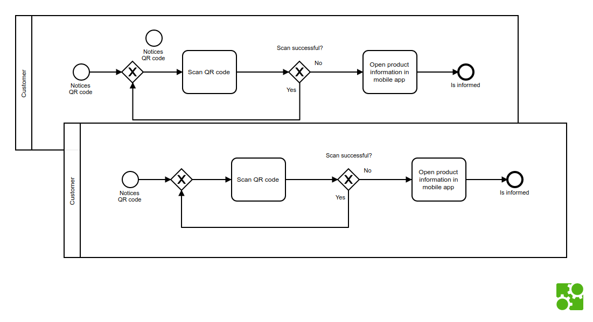

# bpmn-js-copy-paste-example

[](https://travis-ci.org/nikku/bpmn-js-copy-paste-example)

This example shows how to copy and paste elements programatically using [bpmn-js](https://github.com/bpmn-io/bpmn-js).




## Features

* copy and paste between different BPMN modeler instances
* works even across browser windows (!)
* fully scripted
* may be operated by humans, too :wink:


## How it works

You need the [BPMN Modeler](https://github.com/bpmn-io/bpmn-js/blob/master/lib/Modeler.js) to use copy and paste.

#### Copy

To copy an element, specify it via its `elementId`. From that point on,
we'll use only APIs the BPMN modeler provides:

```javascript
// element to be copied
var elementId = ...;

var clipboard = modeler.get('clipboard'),
    copyPaste = modeler.get('copyPaste'),
    elementRegistry = modeler.get('elementRegistry');

// get element to be copied
var element = elementRegistry.get(elementId);

// copy!
copyPaste.copy(element);

// retrieve clipboard contents
var copied = clipboard.get();

// persist in local storage, encoded as json
localStorage.setItem('bpmnClipboard', JSON.stringify(copied));
```


#### Paste

To paste an element we need to specify the target, as well as the location
where the element needs to be pasted:

```javascript
// to be pasted onto...
var targetId = ...;
var position = ...;

var clipboard = modeler.get('clipboard'),
    copyPaste = modeler.get('copyPaste'),
    elementRegistry = modeler.get('elementRegistry'),
    moddle = modeler.get('moddle');

// retrieve from local storage
var serializedCopy = localStorage.getItem('bpmnClipboard');

// parse tree, reinstantiating contained objects
var parsedCopy = JSON.parse(serializedCopy, createReviver(moddle));

// put into clipboard
clipboard.set(parsedCopy);

var pasteContext = {
  element: elementRegistry.get(targetId),
  point: position
};

// paste tree
copyPaste.paste(pasteContext);
```


#### The Paste Catch

During JSON parsing of the serialized copy tree, we use a [`reviver` function](https://developer.mozilla.org/en-US/docs/Web/JavaScript/Reference/Global_Objects/JSON/parse#Using_the_reviver_parameter)
to re-construct model types:

```javascript
function createReviver(moddle) {

  var elCache = {};

  /**
   * The actual reviewer that creates model instances
   * for elements with a $type attribute.
   *
   * Elements with ids will be re-used, if already
   * created.
   *
   * @param  {String} key
   * @param  {Object} object
   *
   * @return {Object} actual element
   */
  return function(key, object) {

    if (typeof object === 'object' && typeof object.$type === 'string') {

      var objectId = object.id;

      if (objectId && elCache[objectId]) {
        return elCache[objectId];
      }

      var type = object.$type;
      var attrs = Object.assign({}, object);

      delete attrs.$type;

      var newEl = moddle.create(type, attrs);

      if (objectId) {
        elCache[objectId] = newEl;
      }

      return newEl;
    }

    return object;
  };
}
```

Checkout the full example [here](./test/copy-paste.js).


## Run the Example

```
# install dependencies
npm install

# run in Chrome
npm test -- --auto-watch --no-single-run
```

Use `F12` in your browser to open the dev tools to see what the heck is going on.


## License

MIT

:heart: